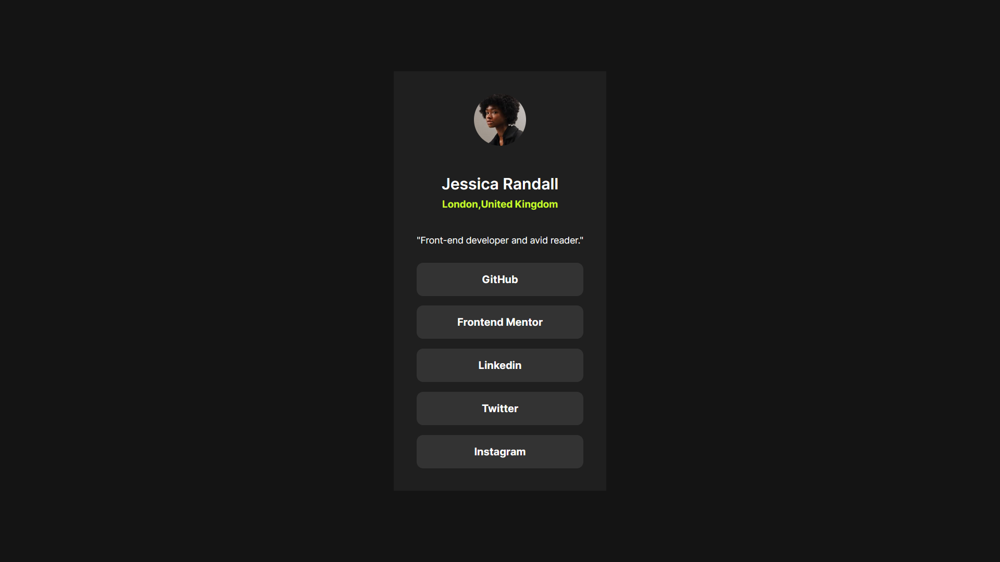

# Frontend Mentor - Social links profile solution

This is a solution to the [Social links profile challenge on Frontend Mentor](https://www.frontendmentor.io/challenges/social-links-profile-UG32l9m6dQ). Frontend Mentor challenges help you improve your coding skills by building realistic projects. 

## Table of contents

- [Overview](#overview)
  - [The challenge](#the-challenge)
  - [Screenshot](#screenshot)
  - [Links](#links)
- [My process](#my-process)
  - [Built with](#built-with)
  - [What I learned](#what-i-learned)
  - [Continued development](#continued-development)
  - [Useful resources](#useful-resources)
- [Author](#author)
- [Acknowledgments](#acknowledgments)

**Note: Delete this note and update the table of contents based on what sections you keep.**

## Overview

### The challenge

Users should be able to:

- See hover and focus states for all interactive elements on the page

### Screenshot

### Links

- Solution URL: [Add solution URL here](https://github.com/CallensJ/social-link-profile)
- Live Site URL: [Add live site URL here](https://callensj.github.io/social-link-profile/)

## My process

### Built with

HTML/CSS

### What I learned
Use of dart sass
@forward&use

### Continued development

### Useful resources

- [Example resource 1](https://sass-lang.com/dart-sass/) - install and use of dart sass

## Author

- Frontend Mentor - [@CallensJ](https://www.frontendmentor.io/profile/CallensJ)

## Acknowledgments

